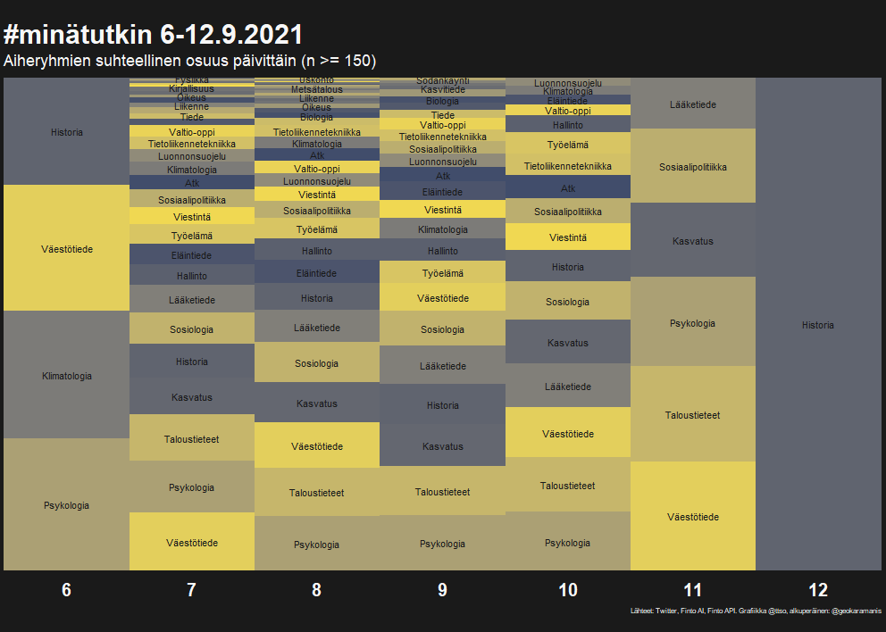

Kuukausi sitten, syyskuun alussa 2021, Twitterin aihetunniste *minätutkin* oli suosittu. Itä-Suomen yliopiston akateeminen rehtori Tapio Määttä [sysäsi ajatuksen liikkeelle](https://twitter.com/tapiomaatta/status/1434449463268057092), ja pian mukaan liitettiin sopiva aihetunniste. Tutkijat innostuivat tiivistämään työnsä twiitin merkkimäärään, ja suuri yleisö innostui yhtä lailla lukemastaan. Vaikka Suomesta löytyy ajantasaisia sivustoja kotimaisesta tutkimuksesta, uusimpana [tutkimustietovaranto](https://www.tiedejatutkimus.fi/fi/), niiden varsinainen fokus ei ole tehdä tiedettä helposti lähestyttäväksi. Toki ne saattavat onnistua siinäkin, mutta vain välillisesti.

Mistä sitten twiitattiin? Mitä olivat ne tieteenalat, joiden tutkijat ehtivät tai kiinnostuivat twiittaamaan? 

Päätin tehdä pienimuotoisen testin siitä, miten Kansalliskirjaston [Finto AI -rajapintapalvelu](https://www.kiwi.fi/display/Finto/Finto+AI%3An+rajapintapalvelu) palvelisi twiittien automaattisessa asiasanoituksessa. Heti alkuun pitää painottaa siitä, että Finto AI/Annif on toistaiseksi pelkkä suosittelija; ihmisen on tarkoitus tehdä lopulliset asiasanavalinnat. Näin toimitaan mm. Jyväskylän yliopiston JYX-julkaisuarkistossa, jossa palvelua käytetään [opinnäytetöiden kuvailun apuna](https://www.kiwi.fi/display/Finto/Finto+AI%3An+rajapintapalvelu):

>Opinnäytetyönsä järjestelmään jättävä opiskelija saa nähtäväkseen Annifin ehdottamat asiasanat, joita hän voi halutessaan muokata. Lopulliset asiasanat hyväksyy kirjastovirkailija tarkistuksen jälkeen. Myös Kirjavälitys Oy käyttää rajapintapalvelua tuottaessaan ennakkotietoja tulevista kirjajulkaisuista. Vastaavanlaista käyttöä pilotoidaan tällä hetkellä mm. Vaasan yliopiston Osuva-julkaisuarkistossa.

Tässä harjoituksessa annan kuitenkin mennä täysautomaatilla, kädet poissa ratilta. 

Alla olevat koodit ovat [Github-repossa](https://github.com/tts/minatutkintweets).

### Twiittien haku ja siivous

Kun haluaa kerätä twiittejä ilman erityisjärjestelyjä, on oltava nopea. Vaikka #minätutkin-häntää on näkynyt aina näihin päiviin asti, hain tässä käsitellyt twiitit jo sunnuntaina 12.9. alkuiltapäivästä enkä sen jälkeen enää uudistanut hakua. Piikki osui välille tiistai-torstai 7-9.9.

Harto Pöngän [10.9 keräämien tilastojen mukaan](https://twitter.com/hponka/status/1436240568045158402) 5000 kappaletta vaikutti sopivalta ylärajalta. Ei uudelleentwiittauksia.

```
library(rtweet)
q <- "#minätutkin"
tweets <- search_tweets(q, n = 5000, include_rts = FALSE)
```

Siivous on enimmäkseen käsityötä. Aivan aluksi poistin selkeimpiä trollauksia, lukijoiden kiittäviä postauksia ja muita tässä yhteydessä epärelevantteja. Myöhemmin kävin vielä twiitit kertaalleen läpi ja filtteröin pois ne, jotka eivät olleet tutkijoilta itseltään vaan suurelta yleisöltä, tutkimusorganisaatiolta tai rahoittajalta. En edes pyrkinyt täydelliseen siivoukseen, ja lisäksi twiiteissä oli rajatapauksia. 

Osa tutkijoista postitti useita #minätutkin-twiittejä. Joiltakin oli unohtunut ensimmäisestä aihetunniste - jolloin se ei siis tarttunut haaviini - jotkut halusivat täydentää, eräät taas jatkoivat aiheen parissa muulla tavoin, innostaen kolleegoita tulemaan mukaan jne. Yhdistin ne kaikki. 

Tämän osuuden koodi on tiedostossa [gettweets.R](https://github.com/tts/minatutkintweets/blob/main/gettweets.R)

### Asiasanoitus

Finto AI -rajapintapalvelulle lähetetään asiasanoitettava teksti HTTP POST -kutsussa. Palautettavien asiasanojen lukumäärää voi säätää (limit), samoin niiden osumistarkkuuden kynnysarvoa (threshold). URL:ssa on oltava tieto projektista eli siitä, minkä kielisestä tekstistä on kyse. Palvelun ohjeistus on interaktiivinen [Swagger-hiekkalaatikko](https://ai.finto.fi/v1/ui/).

En tiedä, kuinka luotettava Twitterin palauttama `lang`-arvo on, mutta joka tapauksessa käytin sitä. Satunnaisotannalla se näytti olevan oikeassa. Kieli ei kuitenkaan ole yksiselitteinen asia, sillä eräät twiittaajat käyttävät twiiteissään kahta kieltä. Ei-englanninkieliselle Twitter-käyttäjälle, jolla on myös englanninkielisiä seuraajia, kieli onkin päänvaiva. Yksi mahdollisuus on ylläpitää kahta erikielistä tiliä, mutta se on kankeaa. Twitter tarjoaa lukijalle automaattista käännösapua, mikä toimiikin aika mukavasti, mutta yhtä kaikki kieli ei suinkaan ole pikkujuttu.


```
resp <- httr::RETRY(verb = "POST",
                    url = paste0("https://ai.finto.fi/v1/projects/", project, "/suggest"),
                    body = make_body(tweet),
                    user_agent("https://github.com/tts/minatutkintweets"))
```

Kaikkien twiittien asiasanoitus tarkoittaa toistuvaa rajapinnan kutsua. Finto AI:n käyttöohjeissa toivotaan, ettei rajapintaa pommitettaisi samanaikaisilla kutsuilla, mikä on ymmärrettävää. Rajapinta on toistaiseksi täysin avoin, mitään rekisteröintiä ei ole. Otin yhteyttä Finton asiakaspalveluosoitteeseen, kun aloin epäillä koodini aiheuttavan ongelmia. Yritin näet lisätä kutsujen väliin `Sys.sleep()` -kutsun, mutta en onnistunut löytämään sille toimivaa koloa; kutsut palauttivat tyhjää. Finton vastaus oli rauhoittava: he eivät olleet huomanneet palvelussa mitään epänormaalia kuormitusta.

Kutsuihin ja tulosten parsimiseen lainasin ison osan vastaavasta koodista [roadoi'lta](https://github.com/ropensci/roadoi), joka on yksi [rOpenSci-yhteisön](https://ropensci.org/) piirissä ylläpidettävistä lukuisista kirjastoista. Minulla oli ilo olla mukana `roadoi`'n [review-prosessissa](https://github.com/ropensci/software-review/issues/115). Siinä keskityin toiminnallisuuteen ja opasteisiin, nyt hyödynsin kirjastoa ensimmäistä kerran kooditasolla. Kysyin Najko Jahnilta, [mihin hän asettaisi paussin](https://github.com/ropensci/roadoi/issues/33). Najko ehdotti, että vaihtaisin `httr`:n tilalle kirjaston [httr2](https://httr2.r-lib.org/). Tutustumisen paikka. Samoin se, miten vaihtaa `plyr::llply` modernimpaan `purrr::map*`-funktioperheeseen, jotta toisteisuus omassa koodissani vähenisi.

Mitä Finto AI ehdotti? Sen näkee twiittikohtaisesti tästä tekemästäni [apurista](https://ttso.shinyapps.io/minatutkintweets/). Valitse ensin päivä ja tunti, ja lopuksi yksi tuon tunnin aikana postitetuista twiiteistä. Kokeile myös vaihtaa palautettavien asiasanojen lukumäärää - ja klikkaa Hae!-nappia. Tulos palautuu muutamassa sekunnissa. Tässä omassa harjoitelmassani käytin kolmea asiasanaa, eikä kynnysarvoa ollut. Finto AI tarjoaa minkä tahansa omavalintaisen tekstin asiasanoitukselle [tämän sivun](https://ai.finto.fi/).

Asiasanoituksen koodi on tiedostossa [finto_ai_keywording.R](https://github.com/tts/minatutkintweets/blob/main/finto_ai_keywording.R) ja interaktiivisen [Shiny](https://github.com/rstudio/shiny)-sovelluksen tiedostossa [app.R](https://github.com/tts/minatutkintweets/blob/main/app.R)

### Ryhmittely

Idea tähän koko harjoitukseen tuli Helsingin yliopiston Ekosysteemit ja ympäristö -tutkimusohjelman professori Sakari Kuikalta. Hän [ehdotti puolileikillään](https://twitter.com/Sakari_Kuikka/status/1435905714455814148), että twiittien perusteella katsottaisiin

>mitkä tieteen alat tulivat esiin, paljonko ne saivat kannatusta ja kuinka suuri niiden rahoitusosuus Suomessa on?

Miten erottaa twiittien vapaasta kielenkäytöstä tieteenala? Vaikeasti. Ilman luonnollisen kielen käsittelyn menetelmiä erotuskyky on enintään "sinne päin". Seuraavalla #minätutkin-kierroksella tutkijoiden pitää käyttää twiiteissään Tilastokeskuksen tieteenalaluokitusta!

Vakavasti puhuen oma tavoitteeni oli saada aikaan visualisointi siitä, mistä aiheista suunnilleen twiitattiin ja mitkä niiden suhteet olivat päivittäin. Pelkkien asiasanojen käyttö ei tuntunut järkevältä. Niitä tulee liikaa. Olisin voinut pysyä tiukasti yhden asiasanan politiikassa per twiitti, jolloin kirjo olisi ollut pienempi, mutta siinä olisi luultavasti menetetty iso osa twiittien sisällöstä. Sitä paitsi ensimmäinen asiasana voi olla täydellinen huti.

Finto-palvelu yllättää monipuolisuudellaan. En ihan heti ymmärtänyt, mitä kaikkea onkaan tarjolla. Tartuin ensimmäiseen löydökseen ja hain asiasanoille yhtä tasoa yleisemmän termin (broader term). Niitä parsiessa kävin vielä kerran läpi vaihtoehtoja ja kas, [Finto API:n](https://api.finto.fi/) sanastokohtaisista metodeista löytyi rajapinta [get_vocid_data](https://api.finto.fi/doc/#!/Vocabulary45specific32methods/get_vocid_data), joka palauttaa mm. asiasanan [käsiteryhmän](https://finto.fi/yso/fi/groups), yhden tai useamman. Ryhmiäkin on paljon, mutta oleellisesti vähemmän kuin erilaisia asiasanoja.

Tämän osuuden koodi on tiedostossa [finto_ontology.R](https://github.com/tts/minatutkintweets/blob/main/finto_ontology.R).

### Visualisointi

Olen seurannut R-ekosysteemin viikottaista [#tidytuesday](https://github.com/rfordatascience/tidytuesday)-tapahtumaa. Viikolla 37 julkaistu datasetti käsitteli USA:n [Billboard Top 100](https://github.com/rfordatascience/tidytuesday/blob/master/data/2021/2021-09-14/readme.md) -listaa. Sen visualisoinneista huomio kiinnittyi Georgios Karamanisin näyttävään [toteutukseen](https://github.com/gkaramanis/tidytuesday/tree/master/2021/2021-week37), jossa vaaka-akselilla on vuosi ja pystyakselilla jaettu pylväsgraafi musiikkityylien suhteellisista osuuksista kunakin vuonna. Otin hänen `ggplot2`-koodistaan mallia.

Karamanisilla musiikkityylit ovat nimen mukaisessa aakkosjärjestyksessä, suuruuserot käyvät ilmi kirjasimen koosta. #minätutkin-esitykseen halusin sen sijaan käsiteryhmät päällekkäin suurimmasta pienimpään, mielellään niin että samalla käsiteryhmällä on aina sama väri. Ollaan faktoreiden (factor) järjestelyn alueella. Lopputuloksessa on runsaasti parantamisen varaa, sillä [löytämäni keino](https://stackoverflow.com/a/53598064) ei toimi, kun ryhmiä on enemmän kuin 30. Jouduin siis rajaamaan niiden lukumäärää keinotekoisesti.


*Twiittien aiheet 7-11.9*

Koska ensimmäinen ja viimeinen keräyspäivä tipahtivat pois, tein vielä erikseen pylväsgraafit jokaisesta päivästä erikseen ja yhdistin samaan kuvaan. Siinä ei päiviä voi varsinaisesti vertailla keskenään ja väriskaala on päiväkohtainen, mutta kuva antaa kuitenkin osviittaa. Jotta pesäero ensimmäiseen kuvaan olisi mahdollisimman selvä, valitsin jälkimmäiseen `viridis`-kirjaston [värikartoista](https://cran.r-project.org/web/packages/viridis/vignettes/intro-to-viridis.html#the-color-scales) vaihtoehdon `cividis`. Ensimmäisessä se on `turbo`, Karamanisia mukaillen.


*Twiittien aiheet per päivä*

Visualisoinnin koodi on tiedostossa [viz.R](https://github.com/tts/minatutkintweets/blob/main/viz.R) ja visualisoitu data tiedostossa [day_group_n.csv](https://github.com/tts/minatutkintweets/blob/main/day_group_n.csv).

### Lopuksi

Alla kirjaamiini päätelmiin pitää suhtautua med en nypa salt. Finto AI ei suinkaan asiasanoita virheettä eikä sen ole nykymuodossa tarkoituskaan, se **ehdottaa**. 

Ryhmän *Yleistermit* suuruus ei yllätä. Ensinnäkin moni yleisluontoinen asiasana kuuluu siihen luonnostaan. Erityisesti ihmistieteissä abstraktiotaso on maallikon silmin korkea, ja #minätutkin-twiittajissa oli runsaasti näiden tieteenalojen edustajia. STEM-tutkijoita (science, technology, engineering and mathematics) oli mukana harvakseltaan, ainakin näinä #minätutkin-ajan alkupäivinä. 

YSO näyttää myös käyttävän usein Yleistermit-ryhmää tietynlaisena vähimmäisvaatimuksena. Esimerkiksi [hyvinvointi](https://finto.fi/yso/fi/page/p1947) kuuluu sekä ryhmään Yleistermit että ryhmiin Sosiaalipolitiikka ja Taloustieteet. Ja onhan se niin, ettei *hyvinvointia* voi tyhjentävästi lokeroidakaan. 
Yleistermiyttä kasvattavat lisäksi lähettäjän useammat #minätutkin-twiitit, jotka yhdistin. Olisi ehkä kannattanut yrittää päätellä ensisijainen ja jättää muut huomiotta, jotta yleiskielen määrä olisi pysynyt minimissä. Muuntelu oli kuitenkin niin suurta, etten edes harkinnut. Olisiko ajallisesti ensimmäinen ollut useimmiten pätevä?

Toinen suuri ryhmä [Väestötiede](https://finto.fi/ykl/fi/page/31.5) sisältää asiasanoja, jotka liittyvät perhepolitiikkaan, aluesuunnitteluun, maahanmuuttoon ja siirtolaisuuteen. 

Vaikka pylväsgraafit pakottavatkin ryhmät tiettyyn järjestykseen, pelkkä vilkaisu kertoo, että suhteelliset erot ovat sittenkin pieniä yleisimpien ryhmien välillä. Kiinnostavasti *klimatologia* oli ensimmäisen päivän ykkösenä, mutta jäi sen jälkeen isompien jalkoihin. *Historia* taas oli tasaisesti suurimpien joukossa kaikkina päivinä.

Finto AI on lupaava ehdotuspalvelu, jolle toivoo pitkää ikää. Tarkkuus ja automaatio varmasti lisääntyvät ajan myötä.
